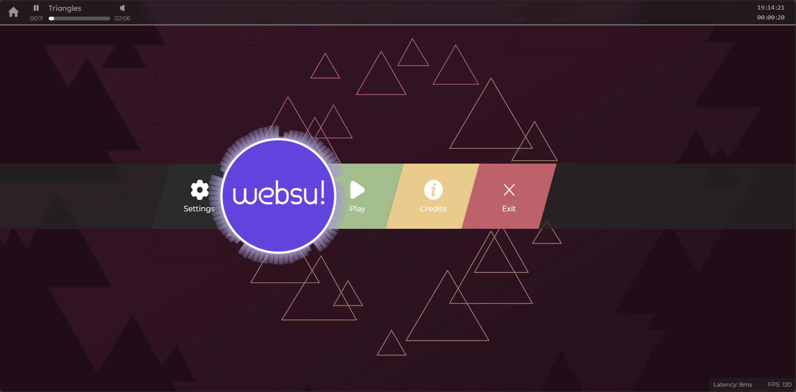
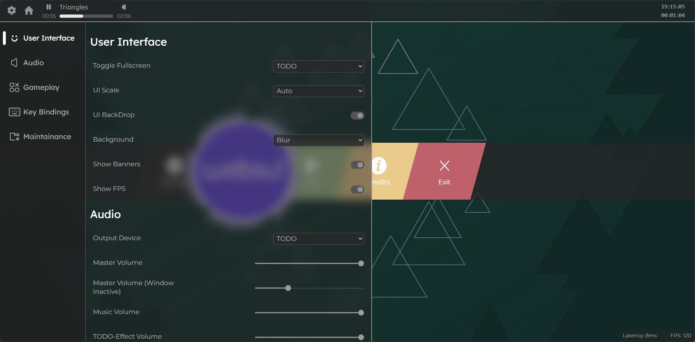
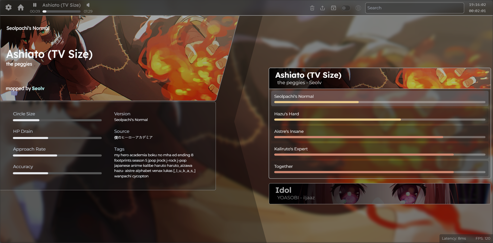
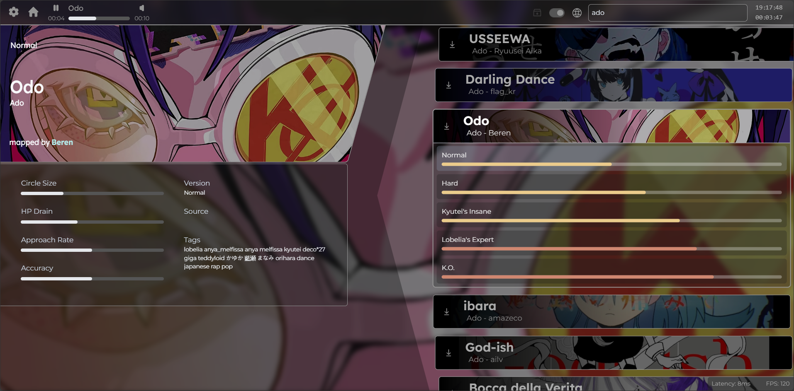

[](https://websu.jpbhatt.tech/)  

### An unofficial web-based port of the rhythm game osu!, inspired by osu! Lazer and designed for easy beatmap browsing and viewing-all in your browser.

#### Try Websu! [here](https://websu.jpbhatt.tech/).

## Features

- **Osu! Lazer 'Triangles' Intro**  
  Experience the iconic animated intro from osu! for instant nostalgia.

- **Osu! Lazer User Interface**  
  Enjoy a sleek, modern UI modeled after osu!lazer for a familiar and intuitive experience.

- **Beatmap Selection**  
  - Load .osz beatmap archive files directly from your local storage.  
  - Search and download beatmaps online using the Mino API.

- **Beatmap Storage**  
  Beatmaps are saved in your browser’s Indexed DB for quick access and offline viewing.

- **Beatmap Viewer**  
  Watch a full run of any loaded beatmap.

## What Doesn't Work Yet

- **Gameplay**  
  Interacting with hit circles (clicking, scoring, etc.) is not yet implemented. You can view beatmaps but not play them.

## Installation

1. Clone the repo:  
   ```bash
   git clone https://github.com/jpbhatt21/websu.git
   cd cengine
   ```
2. Install dependencies:  
   ```bash
   npm install
   ```


## Usage
```bash
npm run dev
```
### Preview
- ### Intro Sequence

    [](https://websu.jpbhatt.tech/)  


- ### Home Screen

    [](https://websu.jpbhatt.tech/) 


- ### Settings Menu

    [](https://websu.jpbhatt.tech/)


- ### Beatmap Selection

    [](https://websu.jpbhatt.tech/)


- ### Online Beatmap Search

    [](https://websu.jpbhatt.tech/)


## Roadmap

- Implement interactive beatmap gameplay (clicking, scoring, etc.)
- Add support for more osu! game modes (osu!mania, osu!taiko, osu!catch)
- User profiles and high score tracking

## Credits
- Intro music: [triangles (osu !Lazer) - cYsmix](https://soundcloud.com/olemlanglie/cysmix-triangles-osulazer)
- Intro sequence: [Inspired by the osu! Lazer 'triangles' intro sequence - ppy](https://x.com/ppy/status/1161276183998160898?s=09)
- Understandig bezier curves:  [A Primer on Bézier Curves - pomax](https://pomax.github.io/bezierinfo/)
- Beatmap Mirror API: [Mino](https://catboy.best/)
- Icons: [SVG Repo](https://www.svgrepo.com/)
- And finally, [ppy](https://github.com/peppy)

## License

This project is not affiliated with or endorsed by osu! or ppy.  
MIT License

